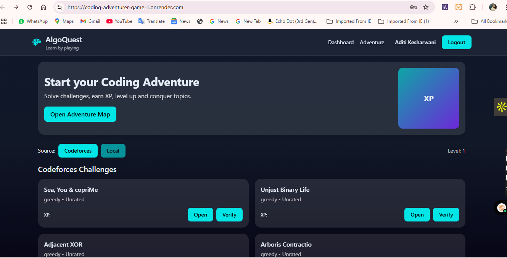
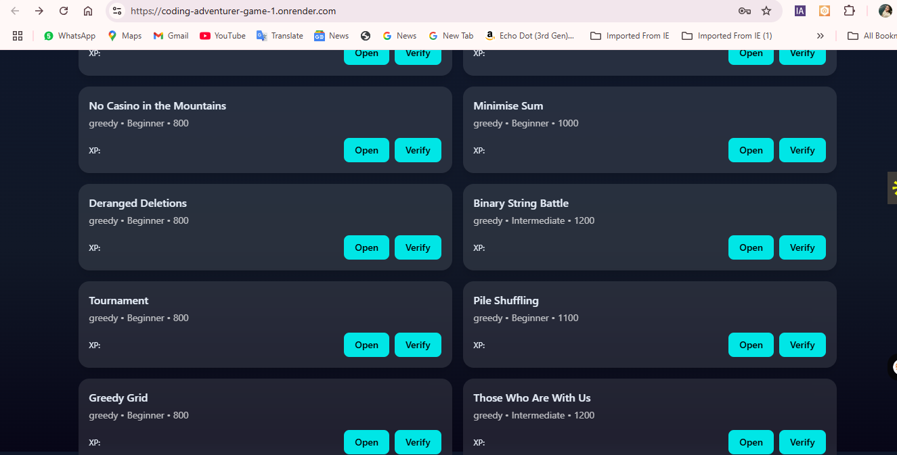
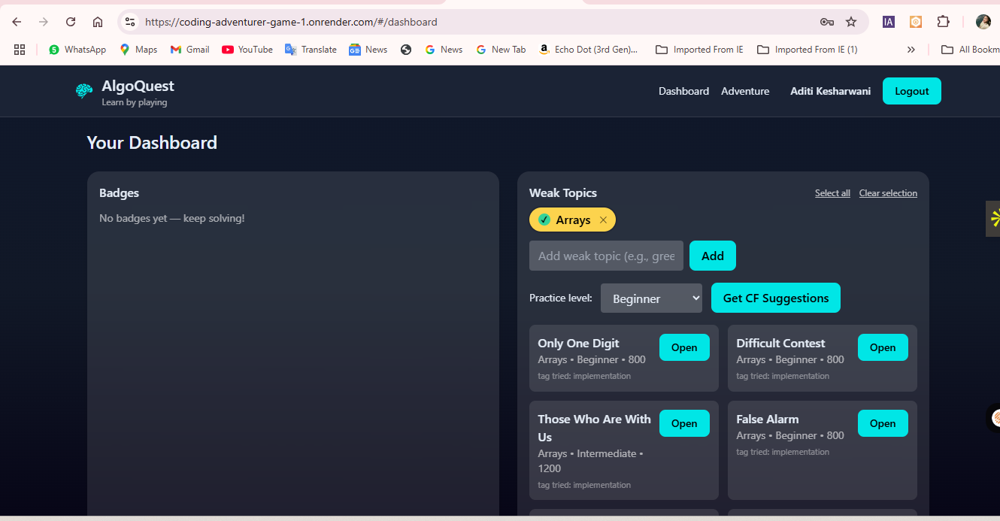

# Coding Adventurer Game

This is the **Coding Adventurer Game** project, deployed live at:
🔗 [Live Demo](https://coding-adventurer-game-1.onrender.com)

## Screenshots

### Screenshot 1


### Screenshot 2


### Screenshot 3


## How to Run Locally

1. Clone the repository:
   ```bash
   git clone https://github.com/Aditi2354/coding-adventurer-game.git
   cd coding-adventurer-game
   ```

2. Install dependencies for backend and frontend:
   ```bash
   cd backend && npm install
   cd ../frontend && npm install
   ```

3. Set up environment variables in `.env.development` and `.env.production`.

4. Run development servers:
   ```bash
   cd backend && npm run dev
   cd ../frontend && npm run dev
   ```

5. Open in your browser:
   ```
   http://localhost:5173
   ```
